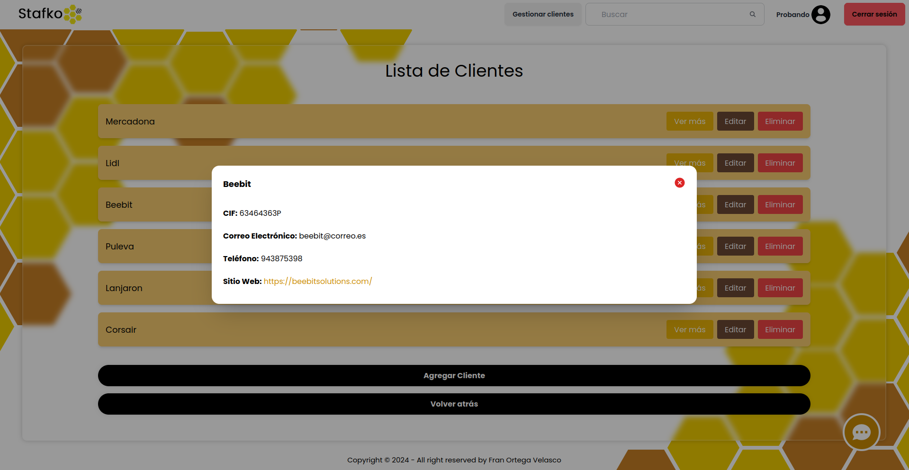

<p align="center" style="padding-top: 3em">
  <a target="blank"></a>
</p>

<h1 align="center">
NestJs Application Stafko - Beebit | Fran
</h1>

La aplicación del Backend se ejecutará en: [http://localhost:3000](http://localhost:3000)

## About

Bienvenido a mi aplicación de gestión de proyectos, creada durante el periodo de prácticas en BeeBit en 2024. Esta aplicación te permite administrar proyectos de manera eficiente, colaborar con tu equipo, gestionar el tiempo con la integración de Clockify y poder hacer uso de ChatGPT desde dentro de la aplicación.

Funcionalidades destacadas:

- Registro de usuarios y autenticación segura.
- Subida y gestión de proyectos.
- Integración con la API de Clockify para registrar tiempo.
- Integración con la API de ChatGPT para poder hacer consultas a la IA.
- Posibilidad de añadir colaboradores y clientes a proyectos.

## Init
### Ejecutar el contenedor:
```bash
docker compose up --build
```

### Instalación de las dependencias necesarias:
```bash
cd ./api && npm install
```

## Screenshots

### Register:


Página para poder registrarnos en nuestra App

### Login:


Página para hacer el login con nuestra cuenta.

### Reset Password:


Página para recuperar la contraseña.

### Main Page:


Página que se nos muestra al hacer login, donde aparecen los proyectos que tenemos creados y en los cuales somos colaboradores. Los colores definen también si somos colaboradores o autores de los proyectos.

### Form Nuevo Proyecto:


Formulario para crear un nuevo proyecto.

### Detalles del Proyecto:


Al hacer clic en un proyecto se nos desplegará esta ventana donde se nos mostrarán todos los detalles del proyecto y en donde tendremos funciones nuevas para cada proyecto. Podremos borrar, editar, descargar archivo (si tiene), registrar tiempo con Clockify, añadir colaboradores, añadir clientes etc.

### Form Editar Proyecto:


Formulario para poder editar un proyecto.

### Detalles del Proyecto si eres colaborador:


Si eres colaborador del proyecto se te mostrará información del mismo, pero con funciones limitadas. No podrás borrar el proyecto, editarlo, añadir/borrar clientes y/o colaboradores.

### Añadir Colaboradores:


Pestaña modal para poder añadir o eliminar colaboradores.

### Añadir Clientes:


Pestaña modal para poder añadir o eliminar clientes.

### Añadir Time Entry en Clockify:


Pestaña modal que conecta directamente con Clockify para poder registrar el tiempo que se invierte en el proyecto.

### Lista de Clientes:


Página que muestra la lista de clientes.

### Form Nuevo Cliente:


Formulario para añadir un cliente nuevo.

### Información del Cliente:



Pestaña modal que muestra información detallada del cliente.

### Editar Cliente:


Pestaña modal que nos permite editar información del cliente.

### Integradción de Chat IA:


Integración de un Chat que conecta directamente con ChatGPT, en donde puedes hablar directamente y hacer uso de la IA a través de este chat, pudiendo preguntar cualquier cosa.

## Contacto

Si tienes alguna pregunta, sugerencia o simplemente deseas ponerte en contacto, no dudes en hacerlo a través de los siguientes medios:

- Correo electrónico: <a href="mailto:fvfotura@gmailcom">fvfotura@gmail.com</a>

## Repositorios de GitHub asociados al proyecto

- <a href="https://github.com/Frorve/Front">Frontend con React</a>

- <a href="https://github.com/Frorve/Back">Backend con NestJS</a>

- <a href="https://github.com/Frorve/Back-Directus">Backend con Directus</a>
