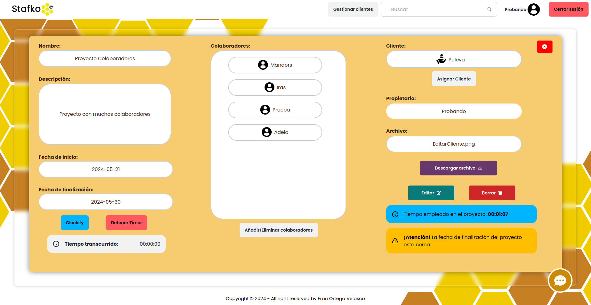

<p align="center" style="padding-top: 3em">
  <a target="blank"></a>
</p>

<h1 align="center">
NestJs Application Stafko - Beebit | Fran
</h1>

La aplicación del Backend se ejecutará en: [http://localhost:3000](http://localhost:3000)

## Init
### Ejecutar el contenedor:
```bash
docker compose up --build
```

### Instalación de las dependencias necesarias:
```bash
cd ./api && npm install
```

## Screenshots

### Register:


### Login:


### Reset Password:


### Main Page:


### Form Nuevo Proyecto:


### Form Editar Proyecto:


### Detalles del Proyecto:
